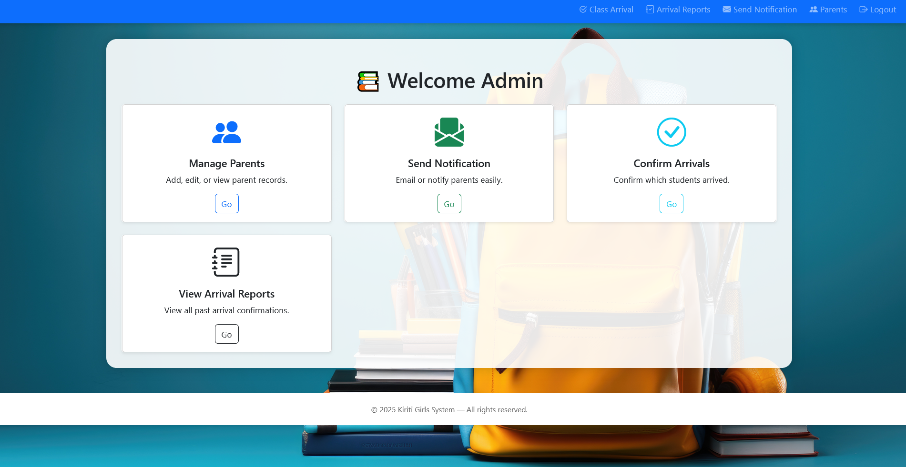
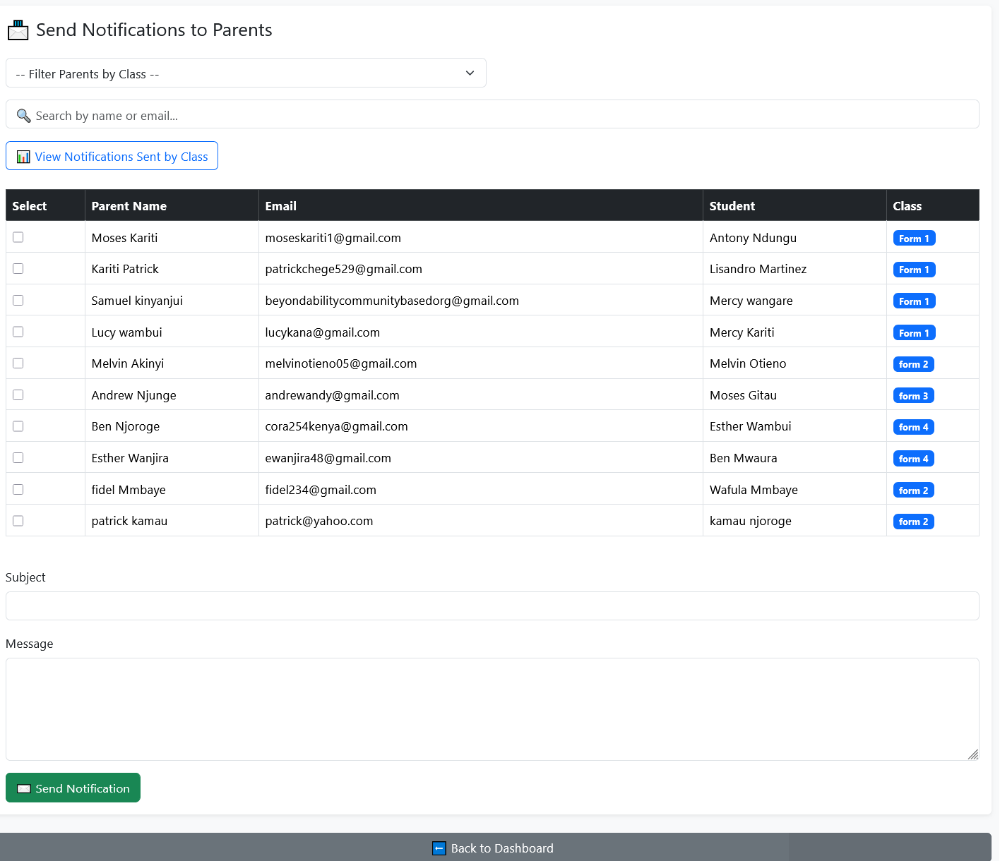

# Parent Memo Notification System

A web-based communication platform designed for schools to enhance communication with parents. The system allows administrators to send notifications, confirm student arrivals, manage parent records, and generate reports efficiently.

---

## ✨ Features
- Send real-time notifications to parents via email.
- Record and manage parent & student details.
- Arrival confirmation for students on opening day.
- Generate class-based reports.
- Secure admin login & responsive dashboard.

---

## 🧰 Technologies Used
- **Frontend:** HTML, CSS, Bootstrap 5  
- **Backend:** PHP  
- **Database:** MySQL  
- **Email Integration:** Gmail SMTP (PHPMailer)

---

## 📸 Screenshots
| Dashboard | Notification Page | Arrival Confirmation |
|------------|------------------|----------------------|
|  |  |  |

---

## ⚙️ Installation
1. Clone this repository:  
   ```bash
   git clone https://github.com/Ware-engineer/Parent_Memo_Notification_System.git
